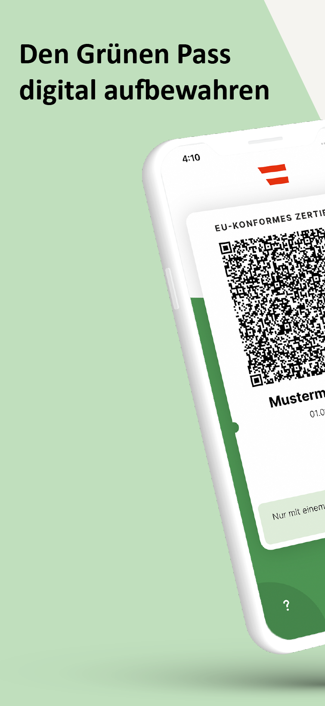
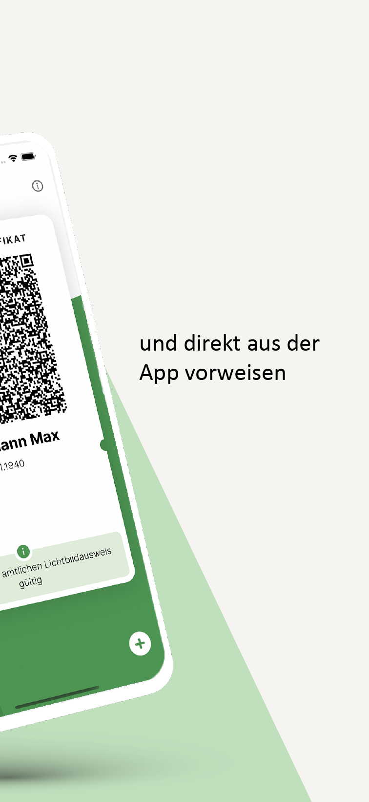
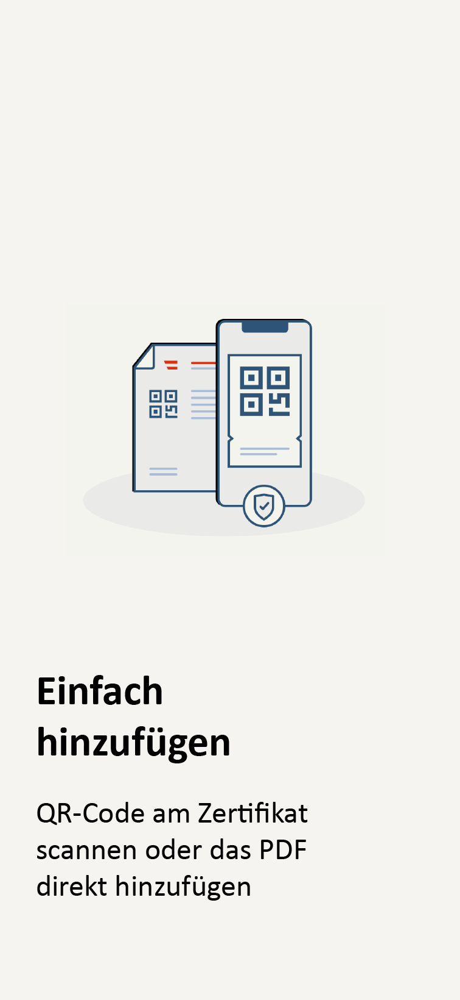
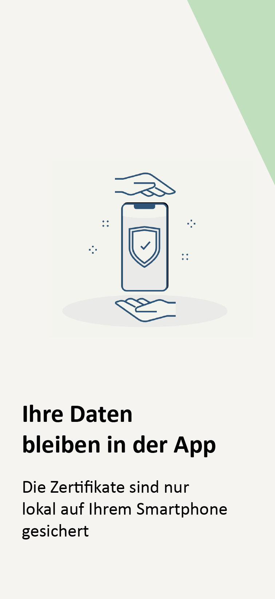

# Grüner Pass App - Android

[](https://github.com/BRZ-GmbH/CovidCertificate-App-Android/blob/main/LICENSE)

Dieses Projekt wurde veröffentlicht durch [Bundesrechenzentrum GmbH](https://www.brz.gv.at/).
Es basiert auf auf der OpenSource-App des [Schweizer Bundesamt für Information und Telekommunikation (BIT)](https://github.com/admin-ch/CovidCertificate-App-Android)

## Grüner Pass App

Der Grüne Pass ist die offizielle App des Bundesministeriums für Soziales, Gesundheit, Pflege und Konsumentenschutz (BMSGPK) zum Verwahren und Vorzeigen von EU-konformen Covid-19-Zertifikaten in Österreich. Geladene Zertifikate werden ausschließlich lokal gespeichert.

<p>
<a href='https://play.google.com/store/apps/details?id=at.gv.brz.wallet'>

</a>
</p>

<p align="center">




</p>

## Beiträge zur Weiterentwicklung der App

Dieses Projekt ist als OpenSource-Projekt gestaltet. Feedback zum Quellcode nehmen wir gerne entgegen.
Bugs oder Probleme sollten als Github issues gemeldet werden. Diese App steht in deutscher Sprache zur Verfügung.

## Repositories

* Android App: [CovidCertificate-App-Android](https://github.com/BRZ-GmbH/CovidCertificate-App-Android)
* Android SDK: [CovidCertificate-SDK-Android](https://github.com/BRZ-GmbH/CovidCertificate-SDK-Android)
* iOS App: [CovidCertificate-App-iOS](https://github.com/BRZ-GmbH/CovidCertificate-App-iOS)
* iOS SDK: [CovidCertificate-SDK-iOS](https://github.com/BRZ-GmbH/CovidCertificate-SDK-iOS)

## Installation and Building

Es muss sichergestellt sein, dass das git submodule korrekt ausgecheckt wurde: `git submodule update --init`.

Das Projekt sollte mit Android Studio 4.1.2 oder neuer geöffnet werden.

Alternativ kann das Projekt mit Gradle gebaut werden:
```sh
$ ./gradlew wallet:assembleProdRelease
```

Damit der Build erfolgt ist, muss ein eigener Keystore eingerichtet werden.

Das APK ist anschließend unter `wallet/build/outputs/apk/prod/release/wallet-prod-release.apk` abgelegt.

## Reproducible builds

Um zu verifizieren, dass die App im Play Store aus dem selben Code besteht, siehe bitte die Instruktionen in [REPRODUCIBLE_BUILDS.md](REPRODUCIBLE_BUILDS.md).

## Lizenz

Dieses Projekt ist lizenziert unter den Bestimmungen der MPL 2 license. Siehe [LICENSE](LICENSE) für Details.
